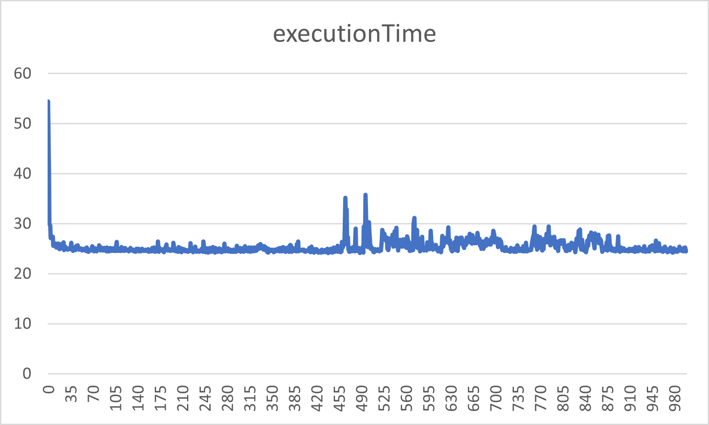
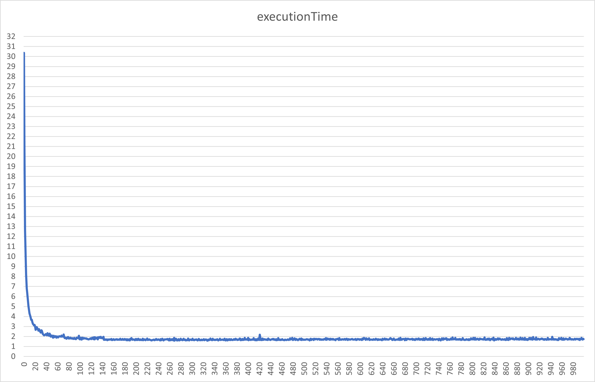

# Parallel Sorting

## TestData
100.000 randomly generated numbers between (0-100.000).

## Hardware
Intel i7-9750H @2.6GHz; 6 Cores

## Sequential version of the algorithms

### MergeSort
Average of 100 runs with the test data: **24.42 ms**

### QuickSort
Average of 100 runs with the test data: **7.74 ms**

## Naive parallelization

### MergeSort
Average of 100 runs with the test data: **42.61 ms**
Spawning so many tasks increased the execution time by a lot. 
It took 1.74 times longer to sort the array! This is dues to a large amount of little tasks which add unnecessary overhead.

### QuickSort
Average of 100 runs with the test data: **9.69 ms**
Again sorting is slower but this time it only took 1.25 times longer. 

## Recursion with thresholds
I took the average of 10 runs with each threshold from 0-1000 and wrote the data to a csv-file. I then generated the following graphs (x axis is the threshold):
### Mergesort
As you can see in the graph the best threshold is somewhere between 10 and 450 with my hardware and 100.000 randomly generated numbers. But we still do not really get speedup if you compare to the sequential solution...

### QuickSort
I would say we have the same conclusion here. We get speedup compared to the naive parallel solution but not compared to the sequential solution. Also the best threshold will be around 10.

## Note:
* QuickSort is faster in our tests because it generally works better on small collection sizes while MergeSort works better on big collection sizes.
* MergeSort is stable with Complexity O(n*log(n))
* QuickSort is unstable with Worst Case O(n^2) and Best Case O(n*log(n))

* QuickSort is typically faster when the data is stored in memory
* MergeSort is faster when the data set is huge and is stored on external devices such as hard drive

I tested with 100 runs and 10.000.000 items as well and still QuickSort was way faster. I guess this is due to Swap being more costly than Compare.