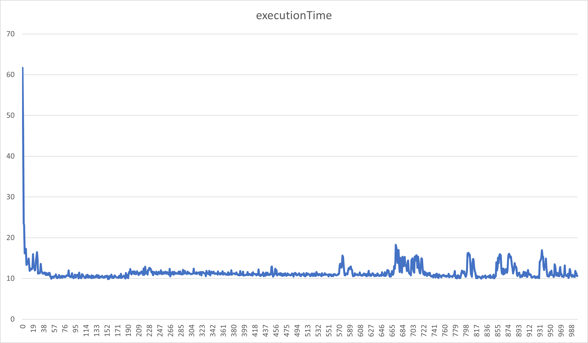
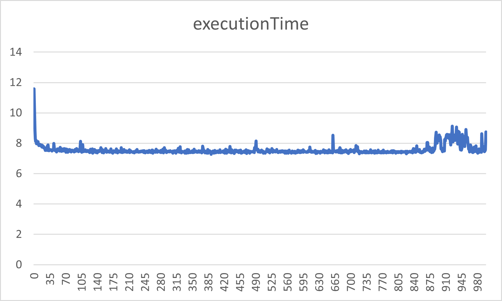
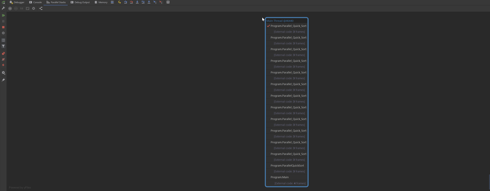
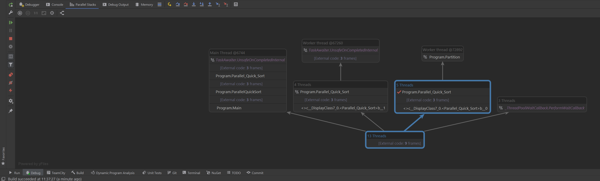

# Parallel Sorting

## TestData
100.000 randomly generated numbers between (0-100.000).

## Hardware
Intel i7-9750H @2.6GHz; 6 Cores

## Sequential version of the algorithms

### MergeSort
Average of 100 runs with the test data: **24.42 ms**

### QuickSort
Average of 100 runs with the test data: **7.74 ms**


## Naive parallelization

### MergeSort
Average of 100 runs with the test data: **42.61 ms**
Spawning so many tasks increased the execution time by a lot. 
It took 1.74 times longer to sort the array! This is dues to a large amount of little tasks which add unnecessary overhead.

### QuickSort
Average of 100 runs with the test data: **23.53 ms**
Again sorting is slower but this time it even took 3.04 times longer. 


## Recursion with thresholds
I took the average of 10 runs with each threshold from 0-1000 and wrote the data to a csv-file. I then generated the following graph (x axis represents the threshold value):
### Mergesort
As you can see in the graph the best threshold is somewhere between 50 and 190 with my hardware and 100.000 randomly generated numbers. At this range it takes around 10ms to sort the array.
So we are approximately 2.5 times faster than the sequential solution was and approximately 4.2 times faster than the naive parallelization.



### QuickSort
As you can see in the graph the best threshold seems to be between 140 and 400 for my hardware and 100.000 randomly generated numbers. At this range it takes around 1.7 ms to sort the array.
So we are approximately 4.5 times faster than the sequential solution and approximately 13.8 times faster than the naive parallelization.


## Note:
* QuickSort is faster in our tests because it generally works better on small collection sizes while MergeSort works better on big collection sizes.
* MergeSort is stable with Complexity O(n*log(n))
* QuickSort is unstable with Worst Case O(n^2) and Best Case O(n*log(n))

* QuickSort is typically faster when the data is stored in memory
* MergeSort is faster when the data set is huge and is stored on external devices such as hard drive

I tested with 100 runs and 10.000.000 items as well and still QuickSort was way faster. I guess this is due to Swap being more costly than Compare.

## Learning

### MergeSort
Those two codeblocks differ greatly from each other! The first block really starts a new thread for the left and right subtree while
the second block jumps into the recursion on the main thread and does not spawn new threads to handle the left and right subtree. This
results in huge performance differences and results in bad performance.
```
var left1 = left;
var leftTask = Task.Run(() => Parallel_Merge_Sort(left1, threshold));
var right1 = right;
var rightTask = Task.Run(() => Parallel_Merge_Sort(right1, threshold));
var results = await Task.WhenAll(leftTask, rightTask);
```

```
var leftTask = Parallel_Merge_Sort(left, threshold);
var rightTask =  Parallel_Merge_Sort(right, threshold);
var results = await Task.WhenAll(leftTask, rightTask);
```
I took the average of 10 runs with each threshold from 0-1000 and wrote the data to a csv-file. I then generated the following graphs (x axis is the threshold):
You can see that the performance is not increasing compared to the sequential solution.


### QuickSort
The same goes for the quickSort code. In the first block the main thread spawns 2 threads handling "left" and "right" which then continue to spawn threads.
The second solution runs into the recursion and basically does everything sequentially on the main thread.

```
if (pivot - left < threshold)
{
    Quick_Sort(arr, left, pivot - 1);
}
else
{
    tasks.Add(Task.Run(() => Parallel_Quick_Sort(arr, left, pivot - 1, threshold)));
}

if (right - pivot < threshold)
{
    Quick_Sort(arr, pivot + 1, right);
}
else
{
    tasks.Add(Task.Run(() => Parallel_Quick_Sort(arr, pivot + 1, right, threshold)));
}

await Task.WhenAll(tasks);
```
```
if (pivot - left < threshold)
{
    Quick_Sort(arr, left, pivot - 1);
}
else
{
    tasks.Add(Parallel_Quick_Sort(arr, left, pivot - 1, threshold));
}

if (right - pivot < threshold)
{
    Quick_Sort(arr, pivot + 1, right);
}
else
{
    tasks.Add(Parallel_Quick_Sort(arr, pivot + 1, right, threshold));
}
if(tasks.Count > 0)
    await Task.WhenAll(tasks);

```
I took the average of 10 runs with each threshold from 0-1000 and wrote the data to a csv-file. I then generated the following graphs (x axis is the threshold):
You can see that the performance is not increasing compared to the sequential solution.



#### Parallel Stacks
The problem gets even more evident if we look at the parallel stacks. Bad Solution quickSort:



Solution of quickSort with Task.Run() (first block):



